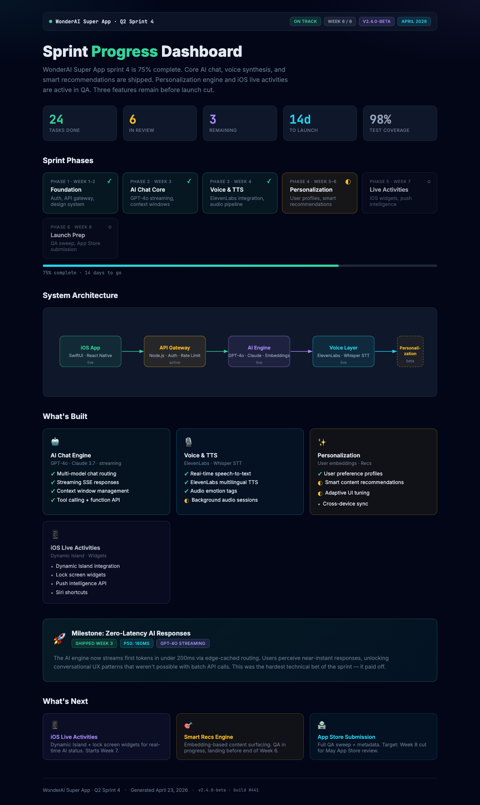
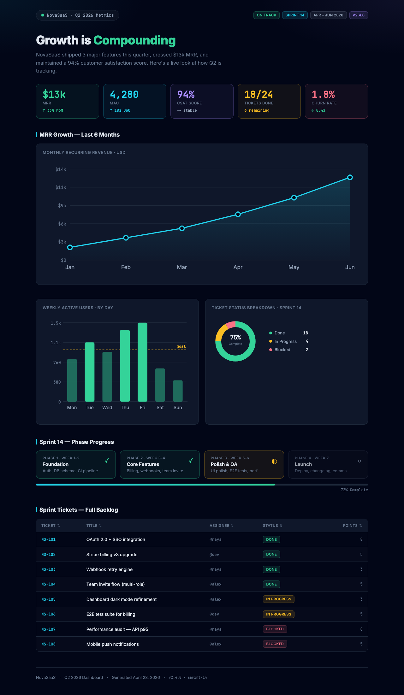

# Visual Dashboard Generator

> Generate beautiful dark-themed status pages as standalone HTML files. Works as a Claude AI skill.

[](https://github.com/ktech99/visual-dashboard-generator)
[](LICENSE)
[](https://claude.ai)

Need a polished, shareable status page? Get Claude to build you one.

## Preview



## Charts & Tables



Use [Claude.ai](https://claude.ai) with this skill to generate professional status dashboards in seconds. Describe your project, sprint, goals, or metrics — Claude creates a beautiful, dark-themed HTML file you can open in any browser, share with teammates, or embed in docs.

- **No design skills needed** — just describe what you want to track
- **Works for any domain** — engineering, personal goals, health, business, life reviews
- **Iterate in chat** — ask Claude to update sections, add metrics, or change the layout
- **Share easily** — output is a single HTML file, no special software required

---

## ⚠️ Requires Claude Pro, Max, Team, or Enterprise plan

---

## 🚀 Quick Install

1. Download **[visual-dashboard-generator.zip](visual-dashboard-generator.zip)**
2. Go to [claude.ai](https://claude.ai) → **Settings** → **Capabilities** → **Skills**
3. Click **+ Add** and upload the zip file
4. Toggle the skill **on**

📚 New to Claude Skills? See the [official guide](https://support.claude.com/en/articles/12512180-using-skills-in-claude).

---

## 💬 Example Prompts

**Engineering sprint:**
```
Create a status dashboard for our Sprint 23. We completed the auth refactor 
and API rate limiting. Testing is in progress. Mobile push notifications are 
next. 8 of 12 tasks done.
```

**Project branch:**
```
Make a status page for the feature/payments-v2 branch. Phase 1 (schema) is 
done, Phase 2 (API) is active, Phase 3 (UI) is upcoming. 3 PRs merged, 
1 open.
```

**Personal goals:**
```
Create a life dashboard for Q2 2026. Goals: run a half marathon (done), 
read 12 books (4/12 in progress), launch side project (next). Add a 
motivational highlight card.
```

**Health metrics:**
```
Build a health tracking dashboard for April. I've hit my step goal 18/23 
days, averaged 7.2hrs sleep, logged 14 workouts. Flag: missed the nutrition 
goal most days.
```

**Business metrics:**
```
Status page for Wonder AI — 3,200 MAU (up 40% MoM), $18k MRR, 4 enterprise 
trials in progress. Highlight the retention improvement. Show what's 
coming in Q3.
```

**Life review:**
```
Create a monthly review dashboard for April 2026. Big wins: shipped payments 
feature, visited NYC. In progress: hiring 2 engineers. Next: board prep, 
product roadmap.
```

**SaaS metrics with line chart:**
```
Show me a metrics dashboard for my SaaS: MRR was $2k Jan, $3.5k Feb, $5k 
Mar, $7.2k Apr. Add a line chart showing the growth trend.
```

**Sprint with ticket table:**
```
Create a sprint dashboard with a table of all 24 tickets: 18 done, 4 in 
review, 2 blocked. Show the breakdown in a donut chart too.
```

**Health bar chart:**
```
Build a health dashboard showing my weekly step counts as a bar chart: 
Mon 8k, Tue 12k, Wed 6k, Thu 9k, Fri 11k, Sat 14k, Sun 5k. Highlight 
days above my 10k goal.
```

**Cumulative progress area chart:**
```
Generate a progress dashboard for my 100-day coding challenge. Cumulative 
problems solved: W1: 12, W2: 31, W3: 58, W4: 79, W5: 103. Show an area 
chart and a table of weekly totals.
```

---

## ✨ What It Generates

Claude builds a fully custom HTML page for each request. Depending on your content, it may include:

| Section | What it shows |
|---------|---------------|
| **Header bar** | Subject name, status pill, live pulse indicator |
| **Hero + stats** | Title, tagline, and 3–5 stat tiles with real numbers |
| **Timeline** | N-step progress grid with done / active / upcoming states |
| **Flow diagram** | SVG showing how stages or systems connect |
| **Step walkthrough** | Numbered plain-English explanation of how it works |
| **Feature cards** | Capabilities with ✓ / ◐ / • markers |
| **Highlight card** | Featured item, achievement, or persona with gradient background |
| **What's next** | Upcoming work, known gaps, Phase 2+ |
| **File tree** | Codebase structure with color-coded labels |
| **Bar chart** | Compare values across categories (pure SVG, no libraries) |
| **Line chart** | Track a metric trend over time with hover tooltips |
| **Donut chart** | Show completion % or category splits as a ring |
| **Data table** | Sortable dark-themed table with color-coded status cells |
| **Footer** | Generated date, subject, version |

---

## 🎨 Design System

All pages share a consistent dark design system:

- **Background**: `#020617` (slate-950) with radial gradient depth
- **Fonts**: Inter (body) + JetBrains Mono (code, numbers)
- **Colors**: Emerald = done, Amber = in-progress, Violet = data/future, Cyan = info, Rose = blocked

---

## 📦 Alternative Installation

**Claude Code / Cursor / Windsurf:**
```bash
# Global skills
unzip visual-dashboard-generator.zip -d ~/.claude/skills/

# Or project-local
unzip visual-dashboard-generator.zip -d ./.claude/skills/
```

**Claude.ai Projects:**
Upload `visual-dashboard-generator.zip` directly to Project Knowledge.

---

## 📄 License

MIT — free to use, modify, and distribute.

---

Made with ❤️ by [Kartik Arora](https://github.com/ktech99)
